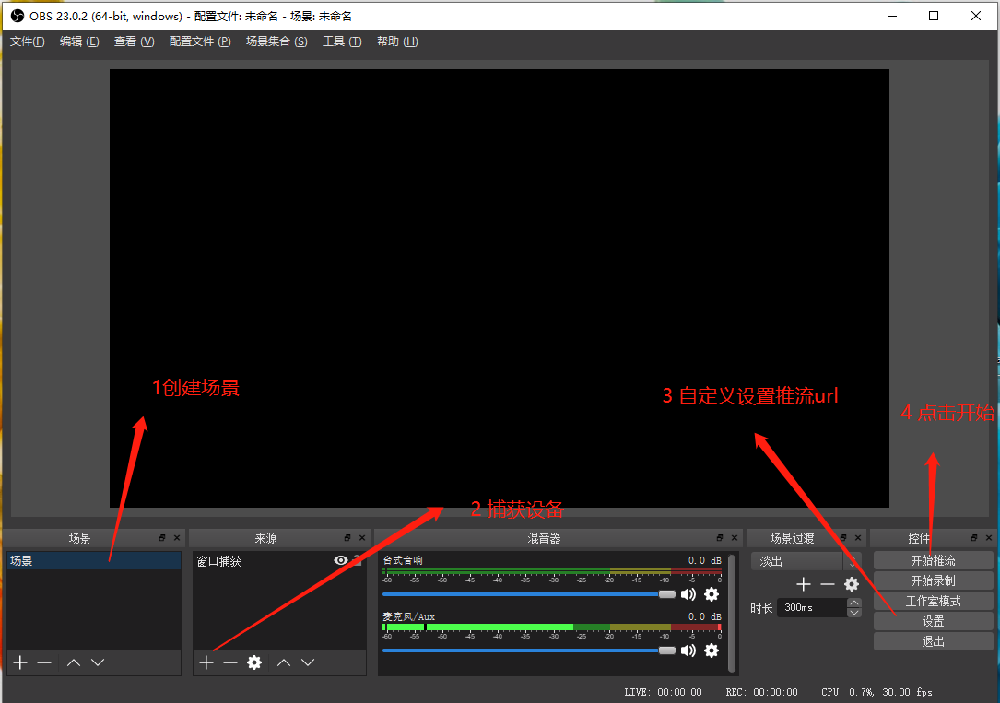

### 直播主要通过两步实现： 1、推流 2、拉流

推流：指的是把采集阶段封包好的内容传输到服务器的过程。推流的设备可以是计算机也可 以是摄像机、或者手机。  
 拉流：指服务器已有直播内容，用指定地址进行拉取播放的过程

### 流媒体服务器的几种协议

推流协议：RTMP  
 拉流协议:RTMP、Http-Flv、hls、dash  
 （1）hls、dash 延迟比较严重 需要 flash 基本不用
（2）Http-Flv 是给予 RTMP 进行封装的，B 站提供 Flv.js 可以直接拉流 不需要 flash
（3）RTMP 常用但需要 flash

### 推流工具：OBS（可以用于 win、linux、Mac）、RTMP 推流摄像机

### 拉流工具：VlC（mac、linux、win 、手机

# node.js 流媒体服务器

#### 生成 json

```
npm  init --yes
```

### 下载

(1)创建 js server.js  
(2)npm install node-media-server --save  
(3) 拷贝代码

```
const NodeMediaServer = require('node-media-server');

const config = {
  rtmp: {
    port: 1935,
    chunk_size: 60000,
    gop_cache: true,
    ping: 30,
    ping_timeout: 60
  },
  http: {
    port: 8000,
    allow_origin: '*'
  }
};

var nms = new NodeMediaServer(config)
nms.run();
```

(4)node 运行文件

```
  node server.js
```

# OBS 推流

路径 URL:rtmp://localhost/live/  
秘钥:STREAM_NAME

### obs 窗口捕获



# 拉流 (格式不同)

```
RTMP
rtmp://localhost/live/STREAM_NAME

http-flv
http://localhost:8000/live/STREAM_NAME.flv


websocket-flv
ws://localhost:8000/live/STREAM_NAME.flv

HLS
http://localhost:8000/live/STREAM_NAME/index.m3u8

DASH
http://localhost:8000/live/STREAM_NAME/index.mpd

```

### 拉流代码

```
<!DOCTYPE html>
<html>
  <head>
    <meta charset="UTF-8" />
    <title></title>
  </head>
  <body>
    <script src="https://cdn.bootcss.com/flv.js/1.4.0/flv.min.js"></script>
    <video muted id="videoElement" style="width: 80%" controls="controls"></video>
    <script>
      debugger
      if (flvjs.isSupported()) {
        var videoElement = document.getElementById("videoElement");
        var flvPlayer = flvjs.createPlayer({
          type: "flv",
          url: "http://localhost:8000/live/wuxinkai.flv",
        });
        flvPlayer.attachMediaElement(videoElement);
        flvPlayer.load();
        flvPlayer.play();
      }
    </script>
  </body>
</html>
```

# 推流增加密钥

1.原始推流或播放地址:

```
rtmp://192.168.0.10/live/stream
```

2.配置验证秘钥为: 'nodemedia2017privatekey'，同时打开播放和发布的鉴权开关

```
const config = {
  rtmp: {
    port: 1935,
    chunk_size: 60000,
    gop_cache: true,
    ping: 60,
    ping_timeout: 30
  },
  http: {
    port: 8000,
    allow_origin: '*'
  },
  auth: {  //鉴权系统
    play: true,
    publish: true,
    secret: 'nodemedia2017privatekey'
  }
};
```
3.请求过期时间为: 2017/8/23 11:25:21 ,则请求过期时间戳为: 转成10位数字
```
1503458721
```
4.md5计算结合“完整流地址-失效时间-密钥”的字符串:
```
HashValue = md5("/live/stream-1503458721-nodemedia2017privatekey”)
HashValue = 80c1d1ad2e0c2ab63eebb50eed64201a
```
5.最终请求地址为
```
rtmp://192.168.0.10/live/stream?sign=1503458721-80c1d1ad2e0c2ab63eebb50eed64201a
注意：'sign' 关键字不能修改为其他的
```
# 获取加密 视频 
加密后的 URL 形式:

```
rtmp://hostname:port/appname/stream?sign=expires-HashValue 
http://hostname:port/appname/stream.flv?sign=expires-HashValue 
ws://hostname:port/appname/stream.flv?sign=expires-HashValu
```
拼接成我们的地址
```
http://192.168.1.5:8000/live/wuxinkai?sign=1603808610-2bada986b6dc6b7e2d0247897c678cde
```